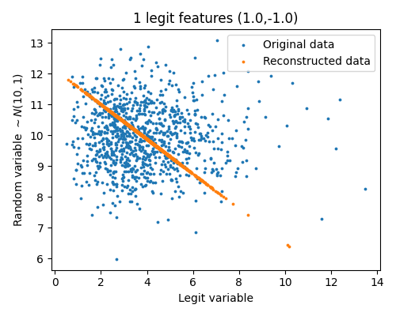

---
title:
- Assignment 1
subtitle: |
    | (Neural Networks Implementation and Application Tutorial)
author:
- Vilém Zouhar, Noon Pokaratsiri Goldstein
theme:
- Boadilla
date: 17th November 2021
aspectratio: 169
header-includes:
  - \AtBeginDocument{}
---

# Overview 

- Assignment 1
- Time effort
- Current assignment (Assignment 2)
- QA

<!--
from SNLP
# Topics

- Language properties, Zipf's Law, Basic statistical formalism
- Information theory (Shannon's game, Code Length, Compression), Entropy
- Language modelling, Backing-off models (interpolation, discounting, smoothing)
- Text classification, Algorithms (kNN, Decision Trees, SVM, \ldots)
- Word Sense Disambiguation, Algorithms (Dictionary based-, translation-, Collocation-based)
- Information retrieval, Latent Semantic Analysis, Singular Value Decomposition
- Machine Translation, Word alignment
- POS Tagging, Named Entity Recognition 
- - Sequence labeling (Hidden Markov models, Conditional Random Fields)
-->

# Assignment Submission Deadline

::: frame
##  Late submissions (>10mins) will not be accepted unless previously agreed upon!
:::


- Mandatory groups of 2 (1 group of 3 as previously discussed)
- Usually 2-3 exercises per assignment + a possible bonus question
- Jupyter notebook templates
  - Assignment + solution in the same notebook
  - Can use Google Colab or local runtime
  - Write solutions in Python files and import them
  - Submitted notebook must only contain your analysis and outputs
- Only one submission per group
  - Submit through Teams

# Organization

\centering

Questions?

# Assignment 1

- Questions?
- Did it work?
- How long did it take?

## Feedback:
- Change \textcolor{red}{TODO} to \textcolor{green}{Solution}.
- Don't forget to write amount of work.
  - Useful for our estimates of difficulty.

# PCA

::: {}

\centering
{width=40%}

:::

## Questions {width=15px}
> - What will be the first principal component?
> - Does anyone know how PCA works?
> - What does it mean that we take only $k$ largest principal components?

<!-- 
```
1.   standardize data = raw data - mean / standard deviation of data
2.   M = covariant_matrix(standardize data)
3.   eigenvalues, eigenvectors = eig(M)
4.   feature_vector = select_n_highest_components(eigenvectors)
5.   projected data = standardized_data dot feature_vector
```
-->

# PCA

- Is it safe to say that the first component will always contain the most important information? {width=15px}

. . .

::: columns
:::: column

::::

:::: column

::::
:::

# Standardization

- Is not normalization! ($x' = \frac{x}{|x|}$)
- $X = \frac{X - \text{mean}(X)}{\text{std}(X)}$
- Compute either:
  - With Numpy: `X = (X-X.mean())/np.std(X)`
  - With Scikit: `StandardScaler().fit_transform(X)`

- Why do we need standardization for PCA? {width=15px}

# Assignment 2

- Any questions?

# Resources

1. Course Website: [lsv.uni-saarland.de/neural-networks-implementation-and-application-winter-2021-2022-2](https://www.lsv.uni-saarland.de/neural-networks-implementation-and-application-winter-2021-2022-2/)
2. Piazza: <https://piazza.com/class/kvc3vzhsvh55rt> 
3. Tutorial repository [github.com/zouharvi/uds-nnia-tutorial](https://github.com/zouharvi/uds-nnia-tutorial)
4. Lecture & tutorial teams channels
